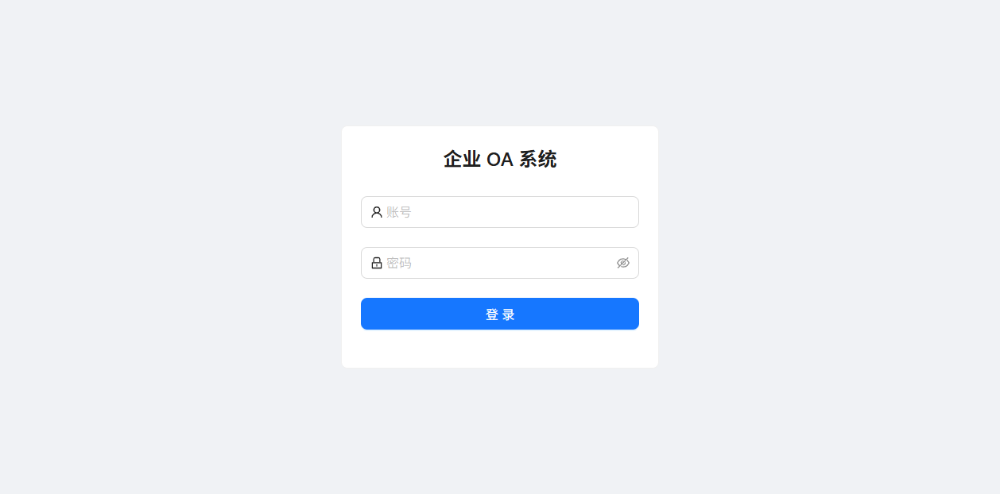
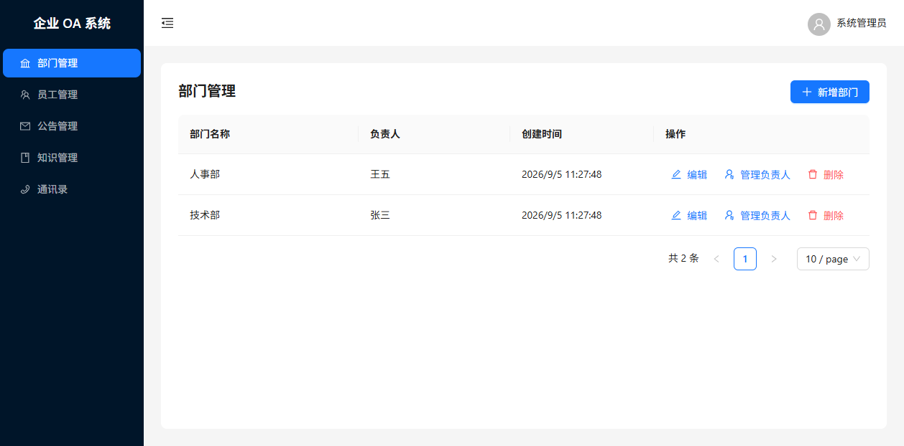
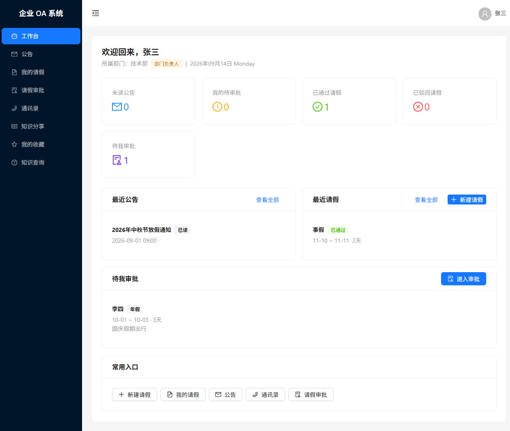
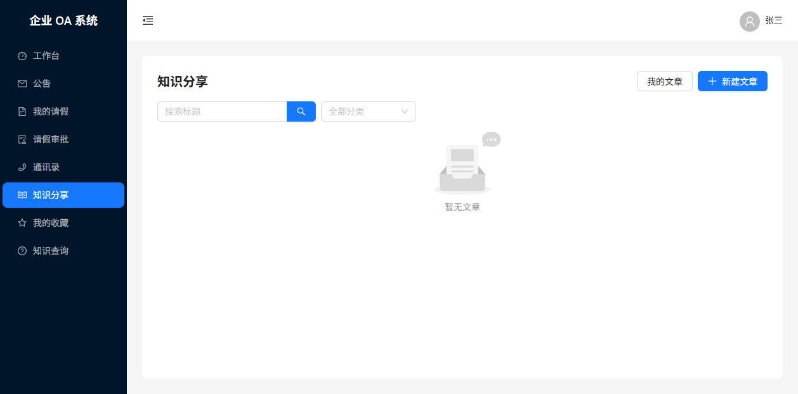

# 企业 OA 协同办公系统 V1.0

<p align="center">
  
  
  
  
  
  
  
  
  
</p>

面向小型企业的内部协同办公系统，提供组织架构、公告发布、请假审批、知识社区等核心功能。采用前后端分离架构，支持管理员与员工两种角色，553 项自动化测试全部通过。

---

## 📸 系统预览

<table>
  <tr>
    <td align="center"><b>登录页面</b></td>
    <td align="center"><b>管理员后台</b></td>
  </tr>
  <tr>
    <td></td>
    <td></td>
  </tr>
  <tr>
    <td align="center"><b>员工工作台</b></td>
    <td align="center"><b>知识分享</b></td>
  </tr>
  <tr>
    <td></td>
    <td></td>
  </tr>
</table>

---

## 📑 目录

- [核心功能](#-核心功能)
- [技术架构](#-技术架构)
- [快速开始](#-快速开始)
- [项目结构](#-项目结构)
- [测试](#-测试)
- [已知限制](#-已知限制)
- [许可证](#-许可证)

---

## 🎯 核心功能

<details>
<summary><b>组织与人事管理</b></summary>

| 模块 | 功能 |
|------|------|
| 认证管理 | 登录/退出/强制改密/JWT Cookie 认证/密码重置 |
| 部门管理 | 部门 CRUD/负责人任命与卸任/删除约束检查 |
| 员工管理 | 员工 CRUD/部门调动/密码重置/停用启用 |
| 通讯录 | 全公司员工目录/搜索/部门筛选 |

</details>

<details>
<summary><b>公告与审批</b></summary>

| 模块 | 功能 |
|------|------|
| 公告管理 | 草稿→发布→撤回状态流转/阅读统计/已读追踪 |
| 请假审批 | 申请/编辑/撤回/重新提交/通过/驳回/操作日志 |
| 个人中心 | 个人资料编辑/员工工作台/负责人审批工作台 |

</details>

<details>
<summary><b>知识社区</b></summary>

| 模块 | 功能 |
|------|------|
| 知识分享 | 文章 CRUD/草稿→发布→撤回/分类筛选/标题搜索 |
| 评论系统 | 评论 CRUD/软删除/管理员审核/审计日志 |
| 点赞收藏 | 幂等点赞/收藏管理/失效文章占位 |
| 内容审核 | 下架→复审→通过/驳回/审核原因展示 |
| AI 辅助写作 | 生成草稿/润色改写/生成摘要/过期保护/取消保护 |
| AI 知识问答 | 基于知识库的智能问答/来源引用 |

</details>

**用户角色：**

| 角色 | 权限范围 |
|------|---------|
| 系统管理员 `ADMIN` | 部门/员工/公告/知识管理，内容审核 |
| 普通员工 `EMPLOYEE` | 查看公告/通讯录/知识文章，提交请假，AI 辅助写作 |

---

## 🏗 技术架构

```
┌─────────────────┐      HTTP/REST       ┌─────────────────┐      Prisma      ┌─────────┐
│    浏览器        │ ◄────────────────── │    Express       │ ◄────────────── │  MySQL  │
│   (React SPA)   │    JSON + Cookie     │   (Node.js)     │      SQL        │  5.7    │
└─────────────────┘                      └─────────────────┘                 └─────────┘
       ▲                                         │
       └─────────── Nginx (生产环境) ─────────────┘
                    反向代理 + 静态资源
```

**关键技术决策：**

- **JWT + HttpOnly Cookie**：避免 XSS 窃取 token，配合 `tokenVersion` 实现服务端可控失效
- **乐观并发控制**：请假审批使用 `stateVersion` 防止并发冲突
- **AI 限流**：每用户 10 次/分钟、3 并发、50 次/天（内存实现，重启重置）
- **过期保护**：AI 生成期间正文变化时阻止插入旧结果
- **取消保护**：AbortController 中止请求 + generationId 丢弃迟到响应

---

## 🚀 快速开始

### 环境要求

| 依赖 | 最低版本 |
|------|---------|
| Node.js | v18+ |
| MySQL | 5.7+ |
| npm | v9+ |

### 1. 克隆与安装

```bash
git clone https://github.com/tengdawang766-dotcom/enterprise-oa-system.git
cd enterprise-oa-system

# 后端
cd backend && npm install

# 前端
cd ../frontend && npm install
```

### 2. 数据库配置

```sql
CREATE DATABASE oa_system CHARACTER SET utf8mb4 COLLATE utf8mb4_unicode_ci;
```

```bash
cd backend
cp .env.example .env
# 编辑 .env，配置数据库连接和密钥

npx prisma generate
npx prisma migrate dev
npx prisma db seed
```

### 3. 启动开发服务器

```bash
# 后端 (http://localhost:3000)
cd backend && npm run dev

# 前端 (http://localhost:5173)
cd frontend && npm run dev
```

### 4. 默认账号

| 账号 | 密码 | 角色 |
|------|------|------|
| `admin` | `admin456` | 系统管理员 |
| `zhangsan` | `employee123` | 员工（技术部负责人） |
| `lisi` | `employee123` | 普通员工 |

> 首次登录后系统会强制要求修改密码。

---

## 📁 项目结构

```
enterprise-oa-system/
├── backend/                    # Express + TypeScript + Prisma
│   ├── src/
│   │   ├── common/             # 认证、异常、日志、响应格式
│   │   ├── infrastructure/     # 配置、数据库连接
│   │   └── modules/            # 业务模块
│   │       ├── auth/           # 认证（登录/退出/改密）
│   │       ├── department/     # 部门管理
│   │       ├── user/           # 员工管理
│   │       ├── announcement/   # 公告管理
│   │       ├── leave/          # 请假审批
│   │       ├── directory/      # 通讯录
│   │       └── knowledge/      # 知识社区（含 AI）
│   │           ├── ai/         # AI Provider / Service
│   │           └── dto/        # 数据验证
│   ├── prisma/
│   │   ├── schema.prisma       # 数据库模型定义
│   │   ├── migrations/         # 迁移记录
│   │   └── seed.ts             # 种子数据
│   └── tests/                  # 后端集成测试（378 项）
│
├── frontend/                   # React + TypeScript + Vite
│   ├── src/
│   │   ├── api/                # Axios API 封装
│   │   ├── components/         # 公共组件（ErrorBoundary、路由守卫）
│   │   ├── layouts/            # 管理员/员工布局
│   │   ├── pages/              # 页面组件
│   │   │   ├── admin/          # 管理员页面
│   │   │   └── ...             # 员工页面
│   │   ├── stores/             # Zustand 状态管理
│   │   ├── types/              # TypeScript 类型定义
│   │   └── lib/                # 工具库（Axios 实例）
│   └── tests/                  # 前端测试（175 项）
│
├── docs/                       # 文档
│   ├── images/                 # 项目截图
│   ├── api-reference.md        # API 参考
│   ├── deployment.md           # 部署指南
│   ├── test-report.md          # 测试报告
│   └── 核心技术复盘与讲解.md    # 技术深度解析
│
├── 项目文档/                    # 完整项目文档
│   ├── 01-需求分析/             # 业务需求、功能定义
│   ├── 02-产品设计/             # 页面需求、API 输入
│   ├── 03-技术方案/             # 技术选型、架构、数据库、API 设计
│   ├── 04-开发规范/             # 前后端模块划分
│   ├── 05-UI设计/               # 低保真布局草图（29 张）
│   └── 06-项目日志/             # 每日开发日志
│
├── docker-compose.yml          # Docker 部署配置
├── LICENSE                     # MIT 许可证
└── README.md
```

---

## 🧪 测试

```bash
# 后端测试
cd backend && npm test    # 378 项，9 个测试文件

# 前端测试
cd frontend && npm test   # 175 项，9 个测试文件
```

| 范围 | 测试文件数 | 测试数 |
|------|-----------|--------|
| 后端 | 9 | 378 |
| 前端 | 9 | 175 |
| **合计** | **18** | **553** |

**测试覆盖：**
- 认证、部门、员工、公告、请假、通讯录全模块集成测试
- AI Provider 模拟 HTTP（成功/错误码/超时/空响应）
- AI 页面交互验证（预览/应用/过期保护/失败保护/取消保护）
- 并发控制、限流、用户状态后置校验
- 前端 API 调用、组件渲染、状态管理

---

## 📖 文档导航

| 文档 | 内容 |
|------|------|
| [项目文档/01-需求分析](项目文档/01-需求分析/) | 业务需求、功能定义 |
| [项目文档/03-技术方案](项目文档/03-技术方案/) | 技术选型、架构、数据库、API 设计 |
| [核心技术复盘与讲解](docs/核心技术复盘与讲解.md) | 认证、Prisma、状态机、并发、React、部署安全 |
| [部署指南](docs/deployment.md) | Docker Compose + Nginx 配置 |
| [测试报告](docs/test-report.md) | 完整测试结果与覆盖分析 |
| [API 参考](docs/api-reference.md) | 接口文档 |

---

## ⚠️ 已知限制

| 限制 | 说明 |
|------|------|
| 单租户架构 | 仅支持单企业使用 |
| 无文件上传 | 公告不支持附件，请假不支持证明材料 |
| 无消息通知 | 缺少站内消息/邮件/短信通知 |
| 审批流单一 | 仅支持单级审批（部门负责人） |
| AI 限流内存实现 | 重启后计数归零，多实例不共享 |
| Docker 未实际构建 | 配置已完成但未在开发机器上运行验证 |
| 无国际化 | 仅支持中文界面 |

---

## 📋 开发进度

| 阶段 | 主题 | 状态 |
|------|------|------|
| Day 1 | 项目初始化与认证基础 | ✅ |
| Day 2 | 部门、员工与负责人管理 | ✅ |
| Day 3 | 公告与通讯录 | ✅ |
| Day 4 | 请假申请与审批 | ✅ |
| Day 5 | 个人资料与工作台 | ✅ |
| Day 6 | 全系统回归与打磨 | ✅ |
| Day 7 | 文档整理与交付 | ✅ |
| Day 8 | 内部知识分享模块 | ✅ |
| Day 9 | 知识社区增强（评论/点赞/审核/AI） | ✅ |

---

## 📄 许可证

本项目基于 [MIT 许可证](LICENSE) 开源。

> 本项目仅用于学习和演示目的。
