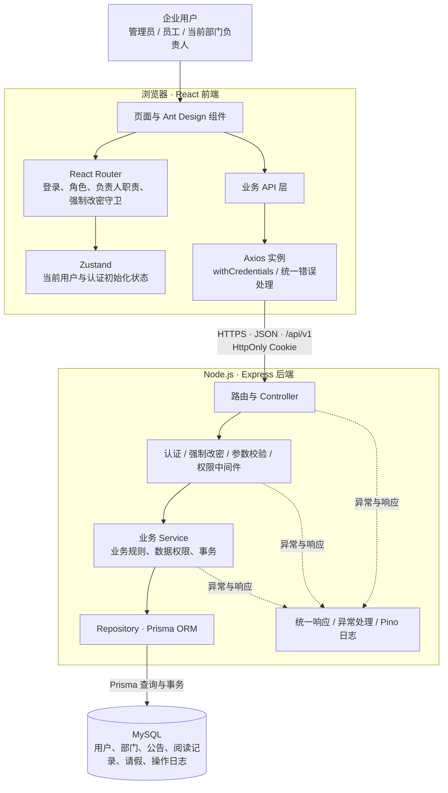
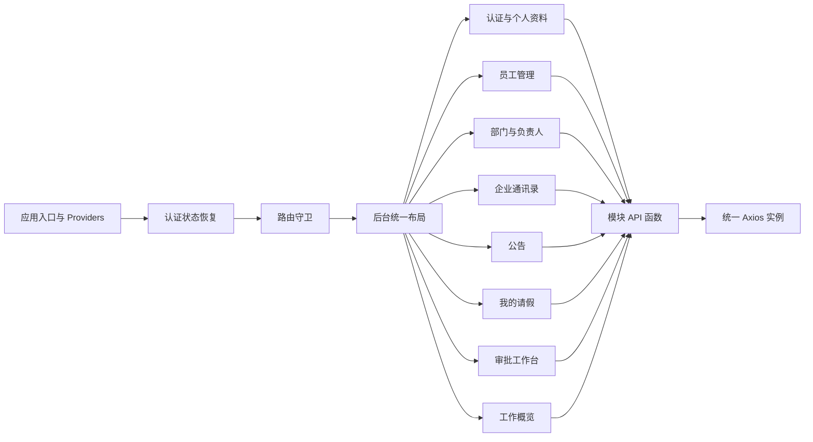
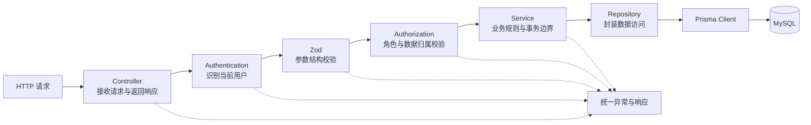
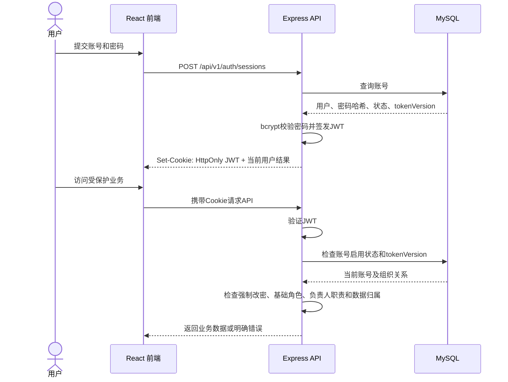
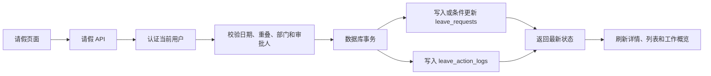
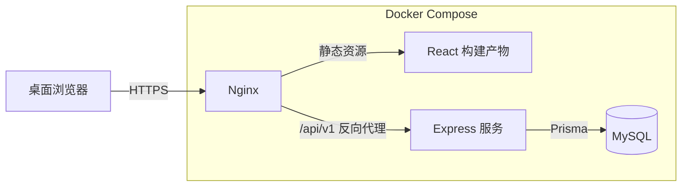

# 企业 OA 协同办公系统 V1.0 系统架构

## 1. 架构目标

本项目采用前后端分离的单体架构，面向约 50 人企业的内部办公场景。架构重点保证业务完整、权限可靠、数据可追溯，并控制一周开发周期内的实现复杂度。

系统由 React 前端、Express 后端和 MySQL 数据库组成。前端通过 REST API 使用后端能力，不直接访问数据库；后端统一执行认证、授权、业务校验和事务控制。

## 2. 系统总体架构图



## 3. 前后端职责边界

| 层级 | 主要职责 | 不承担的职责 |
| --- | --- | --- |
| React 前端 | 页面展示、表单交互、路由体验、调用 API、展示业务结果和错误 | 不直接连接数据库，不读取 JWT，不作为最终权限保障 |
| Express 后端 | 认证、授权、参数校验、业务规则、状态流转、事务、统一异常 | 不依赖前端传入的用户身份、角色或负责人身份作最终判断 |
| MySQL | 数据持久化、关系约束、唯一约束、事务和历史记录 | 不替代后端完成全部业务判断 |

## 4. 前端逻辑架构



前端按业务模块组织。Zustand只保存当前用户、认证初始化、强制改密和当前负责人职责等跨页面状态；员工、部门、公告、请假等列表由页面调用 API 获取。

## 5. 后端逻辑架构



后端按认证、当前用户、员工、部门、通讯录、公告、公告阅读、请假、审批和工作概览分包。Controller不编写数据库查询，Repository不决定业务权限，Service负责组织完整业务操作。

## 6. 认证与权限流程



负责人不是第三种基础角色。用户的基础角色为`ADMIN`或`EMPLOYEE`；当前负责人职责以`departments.manager_user_id`为唯一事实来源。

密码修改或重置后递增`token_version`，使旧JWT失效。账号停用后，后端拒绝其继续访问受保护业务。

## 7. 核心请假业务调用链



审批、驳回和撤销使用`status + state_version`进行条件更新，并在同一事务中写入操作日志。并发操作只有一个能够成功，其余请求返回状态冲突。

## 8. 部署架构



开发环境中前端、后端和MySQL可以分别运行；最终部署使用Docker Compose组织服务，由Nginx提供前端静态资源、API反向代理和HTTPS入口。

## 9. 关键架构约束

1. 所有业务接口统一使用`/api/v1`基础路径。
2. JWT只通过HttpOnly Cookie传递，前端不保存或解析JWT。
3. 前端路由和按钮控制只改善体验，后端必须重新验证权限。
4. 当前用户ID、角色、部门和负责人职责不能由客户端提交后直接信任。
5. 请求DTO和响应DTO分开，响应不得包含密码哈希、tokenVersion和内部异常信息。
6. 业务状态变化由Service控制，关键写操作使用事务和条件更新。
7. 用户及请假记录不进行物理删除，历史归属通过关联和快照保留。
8. 工作概览直接查询业务数据，不建立独立统计表。
9. V1.0保持单体应用，不引入Redis、消息队列、微服务或工作流引擎。

## 10. 架构验证标准

- React只能通过REST API获取和修改业务数据。
- 未登录、账号停用、强制改密和无权限访问均能被后端阻止。
- 管理员、员工和当前负责人获得正确的页面入口和接口权限。
- 公告首次阅读不会产生重复记录。
- 请假提交、通过、驳回和撤销能够保持主记录与操作日志一致。
- 密码修改或重置后旧登录状态失效。
- 服务重启后数据仍然存在。
- 前端、后端和MySQL可以在部署环境中协同运行。


## 内部知识分享架构增量（已完成）

状态：已完成（Day 8）。

```text
Knowledge Pages -> frontend/src/api/knowledge.ts
                -> /api/v1/knowledge
                -> authentication + forcePasswordChange + requireRole(EMPLOYEE)
                -> knowledge.controller.ts
                -> knowledge.service.ts
                -> Prisma KnowledgeArticle / KnowledgeCategory
                -> MySQL
```

模块不建立独立账号体系，复用 `req.currentUser.userId`。列表可见性、详情可见性、作者归属和状态流转均由后端 Service 执行；前端按钮只负责交互提示，不作为安全边界。部署拓扑不变，只增加迁移和前后端代码产物。
